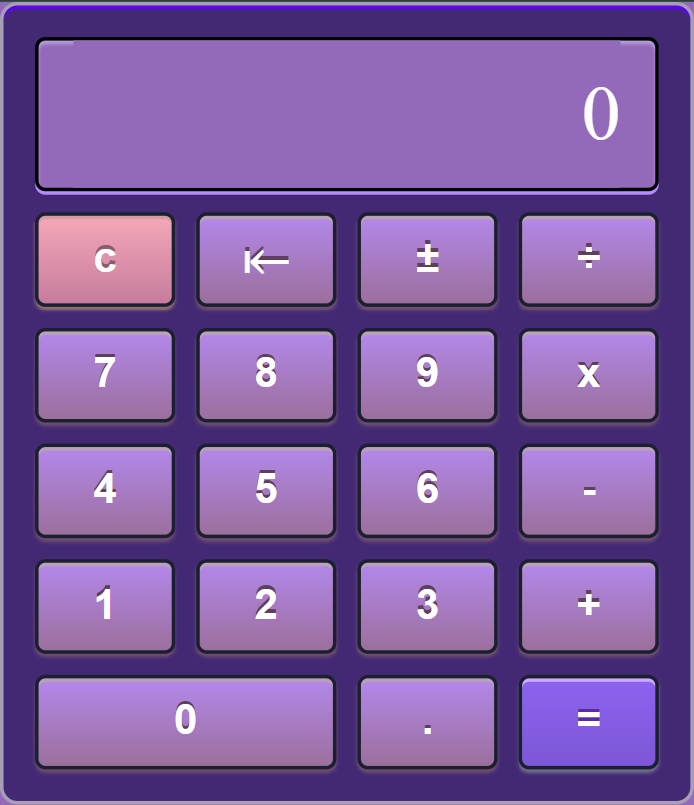

# Calculator

A simple and elegant calculator built using HTML, CSS, and JavaScript.
This project is designed to showcase the basics of creating a functional and visually appealing calculator with modern web technologies.
Whether you're a beginner looking to learn how to build web applications or a seasoned developer wanting a quick tool for basic calculations, this project is a great resource.

## Features

- **Basic Arithmetic Operations**: Perform addition, subtraction, multiplication, and division with ease.
- **Intuitive Button Layout**: Buttons are arranged in a user-friendly manner, mimicking the layout of physical calculators.
- **Clear and Functional Display Area**: The calculator has a well-organized display that clearly shows the current input, operations, and results.
- **Real-time Calculation**: As you input data, the calculator processes it in real-time, giving you instant results.
- **Error Handling**: The calculator includes basic error handling for operations like division by zero.
- **Keyboard Support**: Use your keyboard for quick input—numbers, operators, and the Enter key for equals.
